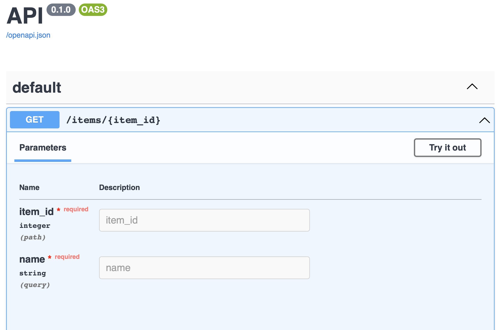

<p align="center">
  <a href="https://www.xpresso-api.dev"></a>
</p>

<p align="center">
<a href="https://github.com/adriangb/xpresso/actions?query=workflow%3ACI%2FCD+event%3Apush+branch%3Amain" target="_blank">
    
</a>
<a href="https://codecov.io/gh/adriangb/xpresso" target="_blank">
    
</a>
<a href="https://pypi.org/project/xpresso" target="_blank">
    
</a>
<a href="https://pypi.org/project/xpresso" target="_blank">
    
</a>
</p>

Xpresso is an ASGI web framework built on top of [Starlette], [Pydantic] and [di], with heavy inspiration from [FastAPI].

Some of the standout features are:

- ASGI support for high performance (within the context of Python web frameworks)
- OpenAPI documentation generation
- Automatic parsing and validation of request bodies and parameters, with hooks for custom extractors
- Full support for [OpenAPI parameter serialization](https://swagger.io/docs/specification/serialization/)
- Highly typed and tested codebase with great IDE support
- A powerful dependency injection system, backed by [di]

## Requirements

Python 3.7+

## Installation

```shell
pip install xpresso
```

You'll also want to install an ASGI server, such as [Uvicorn].

```shell
pip install uvicorn
```

## Example

Create a file named `example.py`:

```python
from pydantic import BaseModel
from xpresso import App, Path, FromPath, FromQuery

class Item(BaseModel):
    item_id: int
    name: str

async def read_item(item_id: FromPath[int], name: FromQuery[str]) -> Item:
    return Item(item_id=item_id, name=name)

app = App(
    routes=[
        Path(
            "/items/{item_id}",
            get=read_item,
        )
    ]
)
```

Run the application:

```shell
uvicorn example:app
```

Navigate to [http://127.0.0.1:8000/items/123?name=foobarbaz](http://127.0.0.1:8000/items/123?name=foobarbaz) in your browser.
You will get the following JSON response:

```json
{"item_id":123,"name":"foobarbaz"}
```

Now navigate to [http://127.0.0.1:8000/docs](http://127.0.0.1:8000/docs) to poke around the interactive [Swagger UI] documentation:



For more examples, tutorials and reference materials, see our [documentation].

## Inspiration and relationship to other frameworks

Xpresso is mainly inspired by FastAPI.
FastAPI pioneered several ideas that are core to Xpresso's approach:

- Leverage Pydantic for JSON parsing, validation and schema generation.
- Leverage Starlette for routing and other low level web framework functionality.
- Provide a simple but powerful dependency injection system.
- Use that dependency injection system to provide extraction of request bodies, forms, query parameters, etc.

Xpresso takes these ideas and refines them by:

- Decoupling the dependency injection system from the request/response cycle, leading to an overall much more flexible and powerful dependency injection system, packaged up as the standalone [di] library. This is how Xpresso is able to provide [dependency injection into the application lifespan] and support for [multiple dependency scopes].
- Making the extraction of data from requests an API available to other developers, enabling features like compatibility with libraries other than Pydantic or [MessagePack support] to be made available as 3rd party extensions instead of feature requests. All of this with full support for hooking into the OpenAPI documentation generation.
- [Providing better support for `application/x-www-form-urlencoded` and `multipart/form-data` requests](https://xpresso-api.dev/latest/tutorial/forms/) by describing them with dataclasses or [Pydantic] models. This includes support for advanced use cases like extracting JSON from a form field.
- Better performance by implementing [dependency resolution in Rust], [executing dependencies concurrently] and [controlling threading of sync dependencies on a per-dependency basis].
- Allowing you to describe a single OpenAPI operation that accepts multiple content/types and extracting the right one based on headers
- Giving you the ability to access and modify responses from within dependencies, allowing you to replace timing, tracing and logging middleware (which is routing ¨naive) with routing aware dependencies. No more middleware that accepts a regex pattern of paths!
- Allowing dynamic building of security models triggered by lifespan events (you can load your Security model config from the enviroment at runtime).
- Use of `Annotated` ([PEP 593]) instead of default values (`param: str = Query(...)`) which decouples the framework from Pydantic and enables a lot of the other features listed above and even allows you to make up your own markers to use if you make [custom Binders].
- Middleware on `Router` so that you can apply auth, logging or profiling to only some routes without resorting to regex path matching.
- Support for lifespans on any `Router` or mounted `App` (this silently fails in FastAPI and Starlette)

[Starlette]: https://github.com/encode/starlette
[Pydantic]: https://github.com/samuelcolvin/pydantic/
[FastAPI]: https://github.com/adriangb/xpresso
[di]: https://github.com/adriangb/di
[Uvicorn]: http://www.uvicorn.org/
[documentation]: https://www.xpresso-api.dev/
[Swagger UI]: https://swagger.io/tools/swagger-ui/
[dependency injection into the application lifespan]: https://xpresso-api.dev/latest/tutorial/lifespan
[multiple dependency scopes]: https://xpresso-api.dev/latest/tutorial/dependencies/scopes/
[MessagePack support]: https://xpresso-api.dev/latest/advanced/binders/#custom-binders-messagepack-body
[dependency resolution in Rust]: https://github.com/adriangb/graphlib2
[executing dependencies concurrently]: https://xpresso-api.dev/latest/advanced/dependencies/performance/#concurrent-execution
[controlling threading of sync dependencies on a per-dependency basis]: https://xpresso-api.dev/latest/advanced/dependencies/performance/#sync-vs-async
[PEP 593]: https://www.python.org/dev/peps/pep-0593/
[custom Binders]: https://xpresso-api.dev/latest/advanced/binders/
