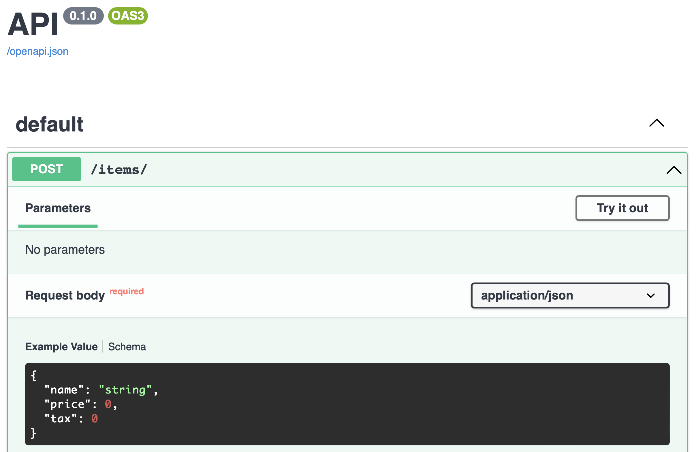
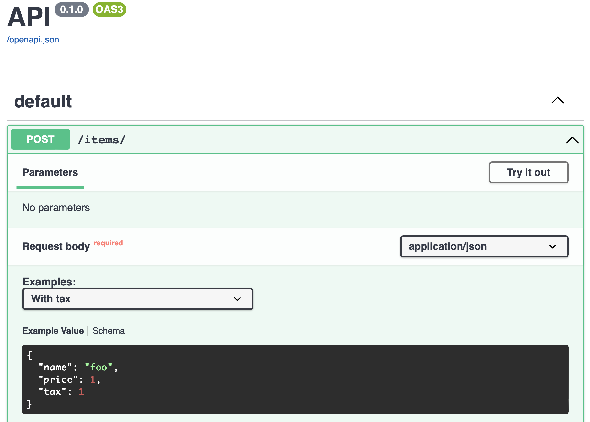

# Request Body

XPresso has a rich system of extractors to extract and parse request bodies.
These help give you type safety, data validation and automatic OpenAPI spec generation.

We'll start off using JSON as an example since this is one of the most common types of request bodies.
But as you will see in the later chapters, a lot of the same concepts apply forms and multipart requests.

## Declaring a body schema

First, we need to define the schema of our body and give XPresso a data structure to extract our body into.
This data structure can be a built in type (like `int` or `str`), a collection (like `dict` or `list`) or a [Pydantic] model.

!!! info "Info"
    Although XPresso makes extensive use of Pydantic and no other similar libraries are supported out of the box, there is no reason why support could not be implemented.
    As you will see later, writing a custom extractor is pretty easy.
    It just doesn't make sense to provide out of the box integration with dozens of libraries, so we chose Pydantic.

For most use cases, you'll want to stick with a Pydantic model.
Declaring a Pydantic model is simple.
Start by importing `BaseModel` from Pydantic and declaring the fields of the model using type annotations:

```python hl_lines="3 8-11"
--8<-- "docs_src/tutorial/body/tutorial_001.py"
```

Then we declare add the `FromJson[...]` marker (which is syntactic sugar for `Annotated[..., Json()]`) to a paramter in our endpoint function:

```python hl_lines="14"
--8<-- "docs_src/tutorial/body/tutorial_001.py"
```

That's it!

Now when you receive a request it will be read as JSON and then passed to Pydantic for validation and parsing.
Your function will receive a validated instance of `Item`.

## OpenAPI and SwaggerUI

Just like path and query parameters, request bodies automatically generate OpenAPI documentation:



## Constraints and Customization

Pydantic supports rich validation and customization of model schemas.
For in depth information on the topic, see [Pydantic]'s docs.
But here is a quick example of how this can work in XPresso.
First, import `Field` from Pydantic and `Annotated`:

```python hl_lines="3 6"
--8<-- "docs_src/tutorial/body/tutorial_002.py"
```

!!! tip "Tip"
    The import `from XPresso.typing import Annotated` is just a convenience import.
    All it does is import `Annotated` from `typing` if your Python version is >= 3.9 and [typing_extensions] otherwise.
    But if you are already using Python >= 3.9, you can just replace that with `from typing import Annotated`.

Now use `Field()` inside of `Annotated[...]` to attach validation and schema customziation metadata to the `price` field:

```python hl_lines="11-17"
--8<-- "docs_src/tutorial/body/tutorial_002.py"
```

!!! tip "Tip"
    Pydantic also supports the syntax `field_name: str = Field(...)`, but we encourage youto get used to using `Annotated` instead.
    As you will see in later chapters about forms and multipart requests, this will allow you to mix in Pydantic's validation and schema customization with XPresso's extractor system.
    That said, for JSON bodies using `field_name: str = Field(...)` will work just fine.

## Using builtin types

While you will probably need Pydantic models for complex cases, in many simple cases you can get away with just using the standard library's container types.
For example, you can declare that a JSON body is a list of integers:

```python hl_lines="7"
--8<-- "docs_src/tutorial/body/tutorial_003.py"
```

## Mixing builtins with Pydantic

You can also wrap an existing Pydantic model in a container, for example to receive a list of items:

```python hl_lines="15"
--8<-- "docs_src/tutorial/body/tutorial_004.py"
```

## Including examples

You can add examples via the `examples` keyword to `Json()`, `FormData()` or `Multipart()`:

```python hl_lines="15-18 22"
--8<-- "docs_src/tutorial/body/tutorial_005.py"
```

The Swagger docs will now reflect this:



[Pydantic]: https://pydantic-docs.helpmanual.io
