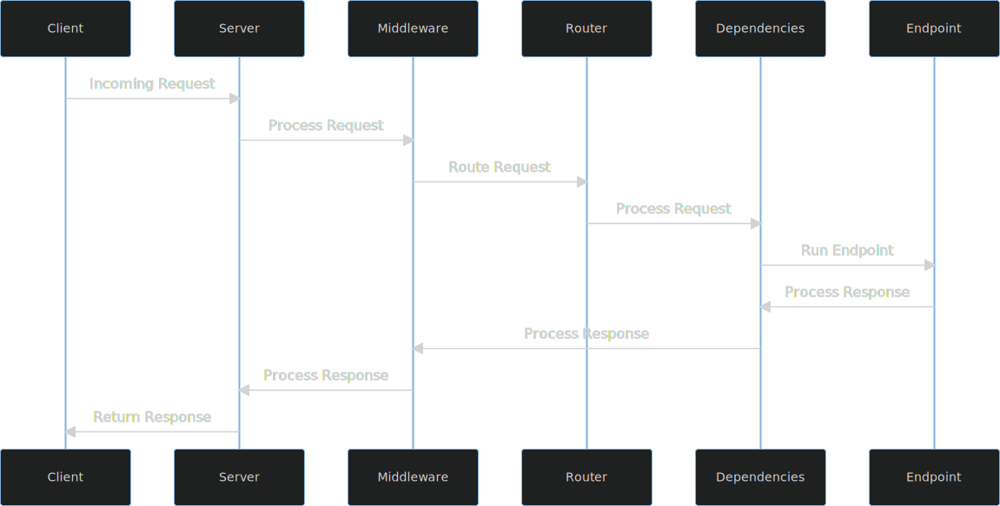

# Middleware

Middleware is code that runs in between the client and your endpoint.
More specifically, middleware runs _before_ routing (more on this later).



Middleware in Xpresso is just standard ASGI middleware.
This enables interoperability with existing middleware written for other ASGI frameworks.
In fact, because Xpresso is based on Starlette it already ships with some of the most useful middleware out of the box. See [Starlette's Middleware Docs] for an exhaustive list of the included middleware.

## Differences between middleware and dependencies

Middleware and dependencies are quite similar, but have some important differences.
Here are a couple differences worth highlighting that you help you in deciding when to use middleware and when to use dependencies:

- Middleware runs before routing, dependencies run after routing. If you need to modify the request path or want to do performance profiling, you'll need to use middleware.
- The dependency system is specific to Xpresso, ASGI middleware is a standard. You are much more likely to find an existing middleware for your use than you are an Xpresso dependency.
- Middleware is generally more performant, unless you need to do work _after_ the response is sent back to the user (which dependencies can do but middleware can not)
- Dependencies can pass in values to your endpoint function, middleware can not (directly) pass data to your endpoint function.
- Middleware can return a Response directly to your client, without passing through your endpoint function. Dependencies can only do this by raising a `HTTPException`.

## Middleware on Routers

Unlike FastAPI and Starlette where middleware is installed on the "application" object (`fastapi.applications.FastAPI` in FastAPI and `starlette.applications.Starlette` in Starlette), in Xpresso middleware is installed on `Router`.
This gives you the ability to selectively apply middleware to only some routes (by mounting a `Router` on a subpath using `Mount`).
Otherwise, the semantics and usage of middleware are still the same: it runs before routing (for the router it is installed on) and it manages both requests and responses.

## Example: CORSMiddleware

As an example of applying a generic ASGI middleware to Xpresso, we'll use Starlette's [CORSMiddleware].

CORS stands for [Cross Origin Resource Sharing], and is an important security feature of modern web applications.
In short, CORS lets you control what origins (a unique combination of protocol, port and host) requests to your API are allowed to come from.
This prevents a malicious site from using authentication credentials stored in your browser to send requests to your backend.

Since CORS is usually something you worry about in the later stages of your app's development, we'll use a more production ready structure here.
Instead of creating an `app` object at the global scope, we'll write app factory functions that create different apps depending on the configuration.
This is one way to make an app work in both a production environment and locally for debugging.
We will also be using [Router Middleware] to selectively apply middleware to only some routes.
In particular, we'll leave the `/health` endpoint open to the public internet (you may or may not want to do this in production; this tutorial is not meant to be a security guide).

Start by defining your data models and endpoint functions

```python hl_lines="11-12 15-16 19-20 23-24"
--8<-- "docs_src/tutorial/middleware/tutorial_001.py"
```

Next define a configuration model for your application using [Pydantic's Settings Management]:

```python hl_lines="27-28"
--8<-- "docs_src/tutorial/middleware/tutorial_001.py"
```

Now define a `create_app()` method that accepts a config and returns an App:

```python hl_lines="31-56"
--8<-- "docs_src/tutorial/middleware/tutorial_001.py"
```

Finally, make a `create_production_app()` method that will load `AppConfig` from environment variables and pass that to `create_app()`:

```python hl_lines="59-61"
--8<-- "docs_src/tutorial/middleware/tutorial_001.py"
```

For debugging or tests you might create a `create_debug_app()` method that passes in the `cors_origin` parameter to `AppConfig` or sets it as an environment variable before calling `AppConfig()`:

```python hl_lines="64-67"
--8<-- "docs_src/tutorial/middleware/tutorial_001.py"
```

[Cross Origin Resource Sharing]: https://developer.mozilla.org/en-US/docs/Web/HTTP/CORS
[CORSMiddleware]: https://www.starlette.io/middleware/#corsmiddleware
[Starlette's Middleware Docs]: https://www.starlette.io/middleware/
[Pydantic's Settings Management]: https://pydantic-docs.helpmanual.io/usage/settings/
