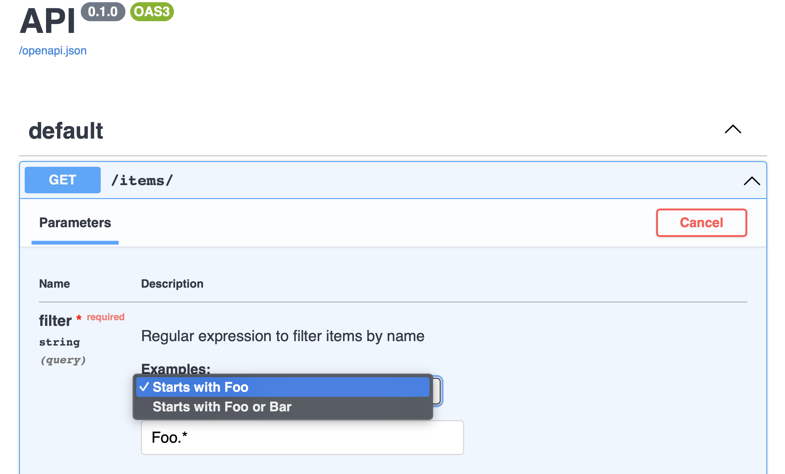

# Constraints and Metadata for Parameters

## Constraints and validation

Query, Path, Header and Cookie parameters benefit from Pydantic's rich validation and schema generation.
You can attach extra validation and schema metadata using Pydantic's `Field()`.
For in depth information on the topic, see [Pydantic]'s docs.
But here is a quick example of how this can work in Xpresso.
First, import `Field` from Pydantic and `Annotated` from `typing` (Python >= 3.9), `typing_extensions` (Python <= 3.9) or `xpresso.typing` (any Python version):

```python hl_lines="1 4"
--8<-- "docs_src/tutorial/param_constraints_and_metadata/tutorial_001.py"
```

!!! tip "Tip"
    The import `from Xpresso.typing import Annotated` is just a convenience import.
    All it does is import `Annotated` from `typing` if your Python version is >= 3.9 and [typing_extensions] otherwise.
    But if you are already using Python >= 3.9, you can just replace that with `from typing import Annotated`.

Now use `Field()` inside of `Annotated[...]` to attach validation and schema customization metadata to the `price` field:

```python hl_lines="10-19"
--8<-- "docs_src/tutorial/param_constraints_and_metadata/tutorial_001.py"
```

!!! note "Note"
    You'll notice that there is some overlap between the parameters to `QueryParam(...)` and `Field(...)`, for example `description`.
    This is just a convenience for you, the developer, so that you don't have to import `Field(...)` for the most common use cases.
    Whenever there is a duplicate parameter, the value in `QueryParam(...)` is preferred with a fallback to `Field(...)`'s value.

!!! tip "Tip"
    If you are adding a lot of metadata, it may be convenient to make a [PEP 613 type alias] at the module level.
    For example, you can do `Limit = Annotated[int, QueryParam(), Field(gt=0)]` and then use that like `limit: Limit` in your endpoint function.
    This is also useful if you are re-using the same parameter in multiple function signatures or even across modules.

Of course, you will get automatic validation of the `gt` constraints and the metadata will be reflected in the  OpenAPI schema:


### Pydantic's types

Pydantic provides a set of types like `HttpUrl` and `constr` (constrained string).
You can use these as the types for parameters and they will be validated and parsed correctly.
For more information, see [Pydantic's docs on the matter](https://pydantic-docs.helpmanual.io/usage/types/#pydantic-types).

## Deprecated parameters

All parameter markers (`PathParam(...)`, `QueryParam(...)`, ...) support a `deprecated` argument.
This can be used to mark a parameter as deprecated in OpenAPI.

## Examples

All parameter markers (`PathParam(...)`, `QueryParam(...)`, ...) support a `examples` argument to add examples to the OpenAPI docs.

First, we'll declare our examples.
Examples are a dictionary with example names as keys and `Example` objects as values.
Each `Example` object requires a `value`, but can also have a description, summary and other metadata.

```python hl_lines="11-14"
--8<-- "docs_src/tutorial/param_constraints_and_metadata/tutorial_002.py"
```

Then we can make an alias for our type declaration to avoid clutter in our endpoint function and enable re-use:

```python hl_lines="16-22"
--8<-- "docs_src/tutorial/param_constraints_and_metadata/tutorial_002.py"
```

Finally we use this type alias in our endpoint function signature:

```python hl_lines="25"
--8<-- "docs_src/tutorial/param_constraints_and_metadata/tutorial_002.py"
```

Our OpenAPI docs will now include the examples:



[Pydantic]: https://pydantic-docs.helpmanual.io
