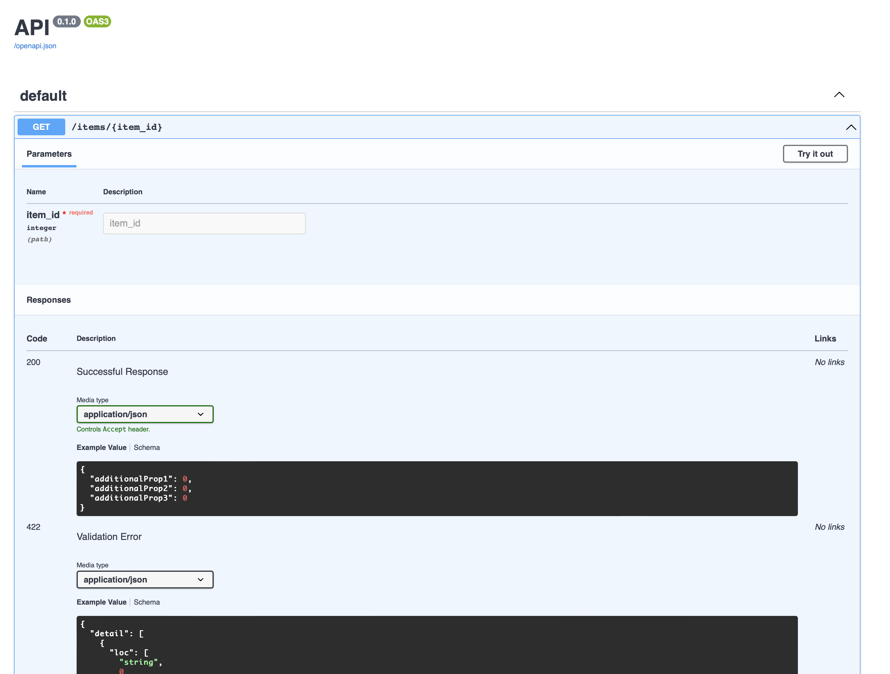

# Path parameters

Path parameters are declared in the route definition, using the same format as formatting strings (`"{}"`):
To tell Xpresso that you want to extract a path parameter and inject it into your function, use `FromPath`.
This is just a marker that tells Xpresso how to inject the value, it has no effect on the function if it is called directly.

```python
--8<-- "docs_src/tutorial/path_params/tutorial_001.py"
```

If you run this example using Uvicorn, you can go to [http://127.0.0.1:8000/items/1234](http://127.0.0.1:8000/items/1234) (`1234` is an arbitrary string) and you'll get a JSON response in your browser like:

```json
--8<-- "docs_src/tutorial/path_params/tutorial_001_response_1.json"
```

## Type conversions

Xpresso uses type annotations from your parameters to do conversions and parsing.
If we modify the example above to expect an `int`, Xpresso will convert the path parameter (which is always a string, since it is coming from a URL) int an `int` and automatically return an error response if it is not a valid integer:

```python
--8<-- "docs_src/tutorial/path_params/tutorial_002.py"
```

Now if you navigate to [http://127.0.0.1:8000/items/1234](http://127.0.0.1:8000/items/1234) (the same URL as before) you will get back a response with an integer instead of a string:

```json
--8<-- "docs_src/tutorial/path_params/tutorial_002_response_1.json"
```

Let's try passing in something that is not an integer. Navigate to [http://127.0.0.1:8000/items/foobarbaz](http://127.0.0.1:8000/items/foobarbaz) and you'll get back:

```json
--8<-- "docs_src/tutorial/path_params/tutorial_002_response_2.json"
```

Under the hood, we use Pydantic for this parsing and validation.
So you can also use Pydantic constraints:

```python
--8<-- "docs_src/tutorial/path_params/tutorial_003.py"
```

!!! info "Info"
    This is probably a good spot to digress and talk about `Annotated` since you may be confused if you are not familiar with it.
    If you've used FastAPI, you may be used to declaring things like `param: str = Path(gt=0)`.
    In Xpresso, this turns into `param: Annotated[str, Path(), Field(gt=0)]`.
    For more background on `Annotated` itself, see the [Python Types] section of our docs.

!!! tip "Tip"
    The import `from Xpresso.typing import Annotated` is just a convenience import.
    All it does is import `Annotated` from `typing` if your Python version is >= 3.9 and [typing_extensions] otherwise.
    But if you are already using Python >= 3.9, you can just replace that with `from typing import Annotated`.

Navigating to [http://127.0.0.1:8000/items/1](http://127.0.0.1:8000/items/1) (a positive value) will give you:

```json
--8<-- "docs_src/tutorial/path_params/tutorial_003_response_1.json"
```

But if you try [http://127.0.0.1:8000/items/-1](http://127.0.0.1:8000/items/-1) (a _negative_ value):

```json
--8<-- "docs_src/tutorial/path_params/tutorial_003_response_2.json"
```

## OpenAPI documentation

If you run one of the examples above and navigate to [http://127.0.0.1:8000/docs](http://127.0.0.1:8000/docs) you'll see the OpenAPI documentation.
It should look something like:



## Array path parameters

Xpresso offers full support for the the [OpenAPI parameter serialization spec].
You can control the serialization style using the `style` and `explode` arguments to `PathParam()`:
The Python type can be a scalar value, a collection (like a list or dict) or even a Pydantic model (for object-valued parameters).

```python
--8<-- "docs_src/tutorial/path_params/tutorial_004.py"
```

Navigating to [http://127.0.0.1:8000/items/;items=1;items=2;items=3](http://127.0.0.1:8000/items/;items=1;items=2;items=3) will return the following JSON:

```json
--8<-- "docs_src/tutorial/path_params/tutorial_004_response_1.json"
```

[Python Types]: ../types.md
[typing_extensions]: https://pypi.org/project/typing-extensions/
[OpenAPI parameter serialization spec]: https://swagger.io/docs/specification/serialization/
