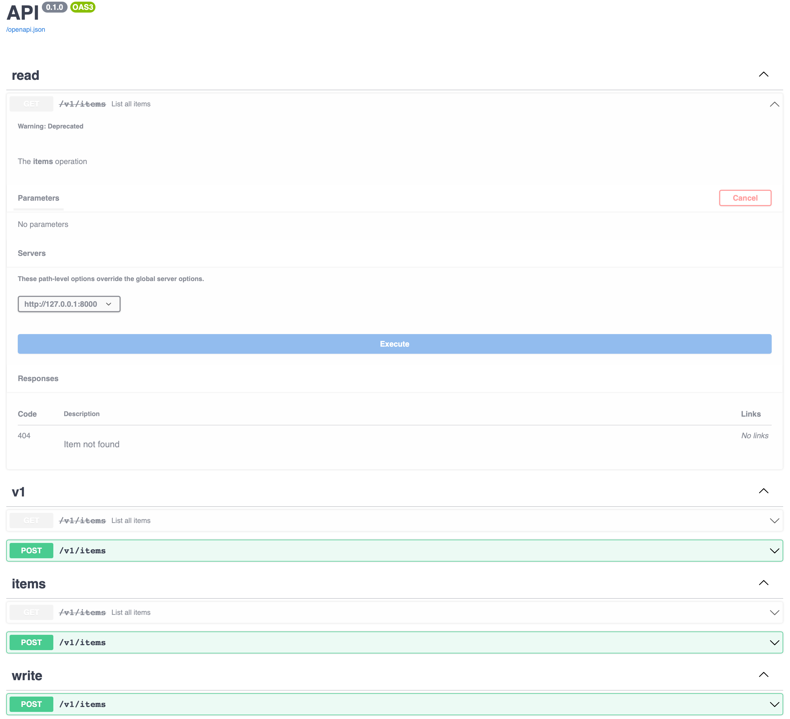

# Routing

Xpresso has a simple routing system, based on Starlette's routing system and the OpenAPI spec.

There are 4 main players in Xpresso's routing system:

- **Operation**: this is equivalent to an OpenAPI operation. An operation is a unique combination of an HTTP method and a path, and has a 1:1 relationship with endpoint functions. Xpresso's `Operation` class is derived from a Starlette `BaseRoute`.
- **Path**: this is the equivalent of an OpenAPI PathItem. A Path can contain 1 Operation for each method (but does not have to). Paths are were you specify your actual path like `/items/{item_id}`. `Path` is derived from Starlette's `Route`.
- **Router**: similar to Starlette's router but only supporting adding routes at initialization (`@router.route` does not exist in Xpresso). Additionally, it supports adding router-level dependencies, middleware and OpenAPI tags.
- **App**: this is the top-level application object where you configure your dependency injection container and OpenAPI docs. Functionality is similar to Starlette's `Starlette` application, but just like `Router` the dynamic methods like `add_middleware()` and `add_exception_handler()` are not supported. `App` also accepts middleware and dependencies, but these are just passed though to its router (`App.router`).

All of these are meant to work with Starlette, so you can mount a `Starlette` application into Xpresso as a route using `Mount`, or use a `Starlette` router in the middle of Xpresso's routing system.

```python
--8<-- "docs_src/tutorial/routing/tutorial_001.py"
```

See [Starlette's routing docs] for more general information on Starlette's routing system.

## Customizing OpenAPI schemas for Operation and Path

`Operation`, `Path` and `Router` let you customize their OpenAPI schema.
You can add descriptions, tags and detailed response information:

- Add tags via the `tags` parameter
- Exclude a specific Operation from the schema via the `include_in_schema` parameter
- Add a summary for the Operation via the `summary` parameter
- Add a description for the Operation via the `description` parameter (by default the endpoint function's docstring)
- Mark the operation as deprecated via the `deprecated` parameter
- Customize responses via the `responses` parameter

```python
--8<-- "docs_src/tutorial/routing/tutorial_002.py"
```

This will look something like this:



!!! note "Note"
    Tags and responses accumulate.
    Responses are overwritten with the lower level of the routing tree tacking precedence, so setting the same status code on a Router and Operation will result in the Operation's version overwriting Router's.
    The servers array completely overwrites any parents: setting `servers` on Operation will overwrite _all_ servers set on Routers or Path.

[Starlette's routing docs]: https://www.starlette.io/routing/
